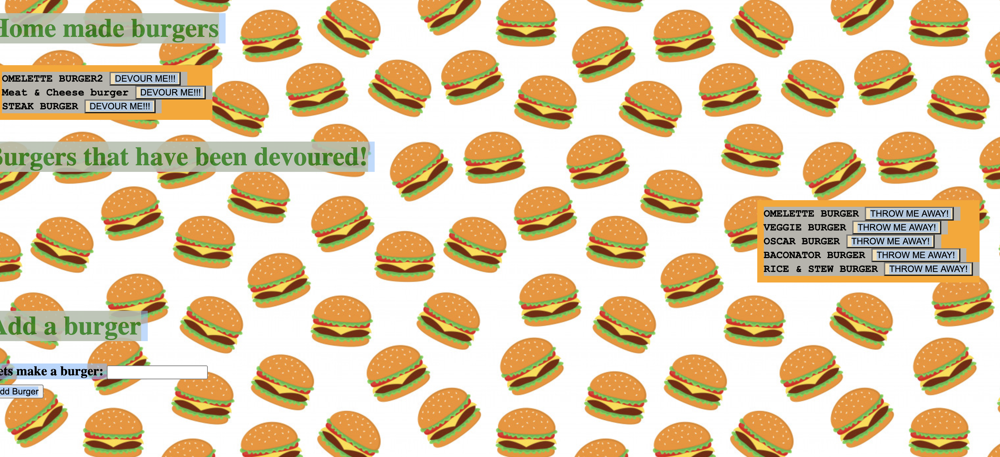

## Project title
Git hub
Come try my delicious burgers or build your own and add it to your menu, if you dont like the burger throw it in the trash.

## Motivation
I wanted to incorporate all of the languages i learned by making a post request, styling with css and pulling information from mysql database to essentially interact with the user on my web page.
## Screenshots

## Tech/framework used
node
<b>Built with</b>
- [Electron](https://electron.atom.io)

## How to use?
When user loads web page they will be allowed to create a burger
When user adds a burger it will be moved to the devoured column
When user views devoured column the burger they added will be there
When user hits "throw it away" it is deleted from devoured menu

## Contribute

Please feel free contritbute to my project by contacting me  A [contributing guideline](https://www.linkedin.com/in/chidi-ekeke-038609172/
## Credits
Calvin Carter

## License
Javascript, Html, Jquery, Node, mySql

MIT © [Chidi Ekeke]()